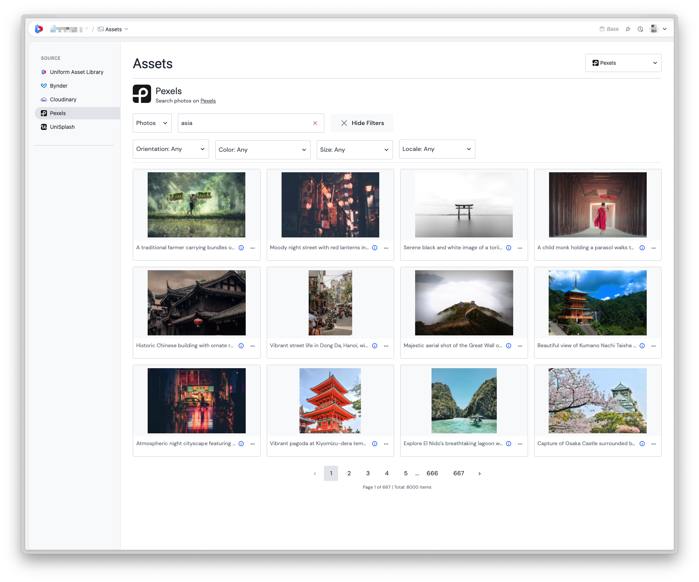
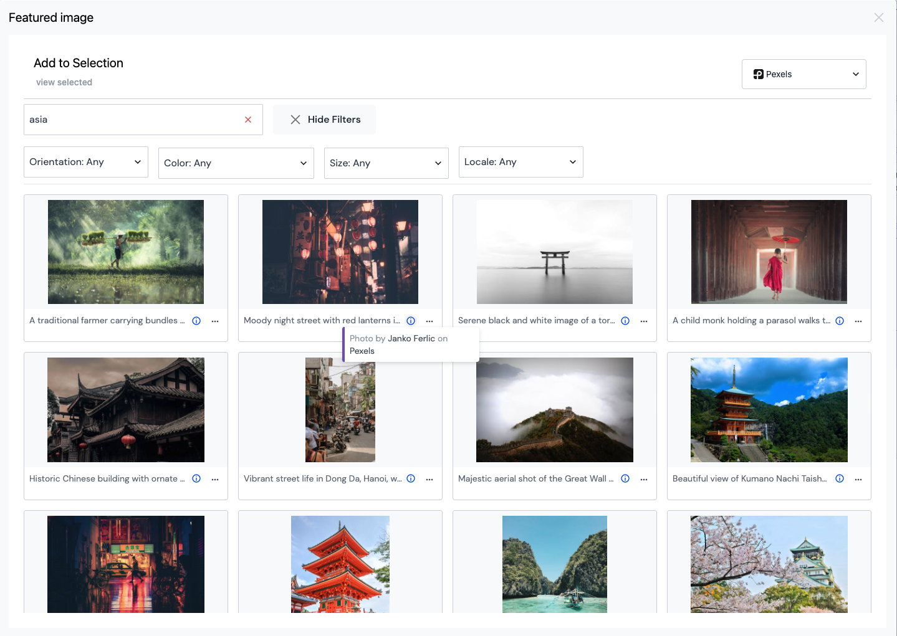

# Uniform Pexels Integration

This is an example integration to extend the [Uniform asset library](https://docs.uniform.app/docs/guides/composition/manage-assets) with [Pexels](https://www.pexels.com) images and videos.

⚠️ **Note:** This is an unofficial community integration, not supported by [Uniform](https://uniform.dev) or [Pexels](https://www.pexels.com). It serves as an example for extending Uniform's asset library with third-party providers like [Pexels](https://www.pexels.com). The codebase was primarily AI-generated using [Cursor](https://www.cursor.com/), with manual review and editing.

## Core Features

- Browse featured photos and popular videos from Pexels
- Search photos and videos, with filters for orientation, size and locale (and color for photos)
- Pick Pexels photos and videos in asset parameters, including parameters that allow several assets
- Preserve Pexels metadata and attribution in the asset record
- Download photos and videos in the sizes Pexels offers
- View photographer and videographer credits

The asset library location (the Pexels tab in the Uniform asset library) is for browsing only: Mesh doesn't let an asset library location add assets to Uniform. Pick assets through an asset parameter instead.

### Screenshots

Asset library:



Asset parameter (in a Uniform project):



### ⚠️ Note: Asset hotlinking

This integration is currently hotlinking photos and videos from Pexels. This is not the recommended way to use Pexels media and is subject to change.

## Basic Usage

1. Sign up for a Pexels account and get an API key on their [developer portal](https://www.pexels.com/api/)
2. [Add](#add-a-custom-integration-to-your-uniform-team) a custom integration to your Uniform team
3. [Install](#install-the-integration-to-your-uniform-project) the integration to your Uniform project

## Installation

### Add a custom integration to your Uniform team

First create a custom integration in your Uniform team:

Via the Uniform dashboard:
1. In your Uniform team, go to Settings > Custom Integrations
2. Click "Add Integration"
3. Paste the contents of a manifest into the Mesh app manifest:
   - `mesh-manifest-production.json` for the deployed app (integration type `pexels`)
   - `mesh-manifest-local.json` for local development against `http://localhost:9000` (integration type `pexels-dev`)
4. Click "Save"

Alternatively, you can use the Uniform CLI to register the production manifest (Team Admin API key required):

```bash
npm run register-to-team
```

### Install the integration to your Uniform project

The integration then can be installed as a custom integration in the projects of the Uniform team:

1. In your Uniform project, go to Settings > Integrations
2. Find the "Pexels" integration in the list and click on it
3. Follow the prompts to install the integration
4. Enter your Pexels API key and other [configuration options](#configuration-options)

Alternatively, you can use the Uniform CLI to install the integration (Team Admin API key required):

```bash
npm run install-to-project
```


## Configuration Options

- **API Key**: Your [Pexels API key](https://www.pexels.com/api/) (required). It is checked against Pexels when you save. The key is sent from the editor's browser, so anyone who can use the integration can see it.
- **Assets Per Page**: Number of assets to display per page, from 1 to 80 (default: 12)
- **Add Author Credits**: Whether to add the credit, e.g. "Photo by John Doe on Pexels", to asset descriptions (default: on). The credit is always stored in `custom.attribution`.

## Stored Asset Data

A picked photo is stored as a Uniform asset with:

- `url`: the original photo file, with `width` and `height` describing that file. The Pexels CDN resizes on request, so frontends should append size parameters instead of loading the original, for example `?auto=compress&w=800`.
- `id` and a stable `_id` (`pexels-image-<id>`), so picking the same photo again gives the same value
- `title`: the Pexels alt text (Uniform assets have no separate alt field), or "Photo by ..." when there is none
- `description`: the alt text, plus the credit when author credits are on
- `mediaType`: e.g. `image/jpeg`
- `custom`: Pexels metadata, including `attribution`, `photographer`, `photographerUrl`, `pexelsUrl`, `avgColor` (useful as a placeholder color), `alt`, and URLs of the fixed Pexels renditions (`photoLargeUrl`, `photoMediumUrl`, ...)

A picked video stores its best quality file (the widest HD file) as `url`, with that file's dimensions and `mediaType`, and `custom` metadata such as `attribution`, `authorName`, `videoThumbnailUrl` and `duration`.

Assets picked with versions before this change used a random `_id`, and their `url` pointed to the ~940px "large" rendition while `width` and `height` described the original photo.

## Media Support

This integration supports both photos and videos from the Pexels API. For detailed information about available formats, sizes, and options, please refer to the official Pexels API documentation:

- [Pexels API Documentation](https://www.pexels.com/api/documentation/)
- [Photos Search Documentation](https://www.pexels.com/api/documentation/#photos-search)
- [Videos Search Documentation](https://www.pexels.com/api/documentation/#videos-search)

## Development

1. Clone the repository and use Node 24 (`nvm use`)
2. Create a `.env` file based on `.env.example`
3. Run `npm install` to install the dependencies
4. Run `npm run dev` to start the development server on port 9000
5. Register `mesh-manifest-local.json` in your team and install the "Pexels (Development)" integration in a project

Checks (also run in CI):

```bash
npm run lint
npm run typecheck
npm test
npm run build
```

## Deployment

The integration can be deployed to any provider that supports static Next.js applications such as Vercel or Netlify.

If you create your own deployment make sure to update the `mesh-manifest-production.json` file with the correct base URL. And copy the contents of the manifest into your custom integration.

## Architecture

The integration is built with:

- Next.js (Page Router) for the location pages
- Uniform Mesh SDK and design system for the locations and UI
- A small typed client for the Pexels API (`lib/pexels/client.ts`), called from the browser
- Vitest for unit tests
- Tailwind CSS for layout

The location pages in `pages/` are thin adapters around `useMeshLocation`. The logic lives in `lib/`: the Pexels client and request routing (`lib/pexels/`), the mapping from Pexels to Uniform assets (`lib/mapping.ts`), selection handling (`lib/selection.ts`) and the hooks that hold the library state (`lib/hooks/`).

## Attribution

The [Pexels API guidelines](https://www.pexels.com/api/documentation/) ask for a prominent link to Pexels wherever API results are shown, and for photographers to be credited whenever possible, e.g. "Photo by John Doe on Pexels" with a link to Pexels. The integration links to Pexels in the asset library and parameter views and shows credits on every item. Each picked asset stores its credit in `custom.attribution`, and, unless turned off in the settings, in its description. Your frontend is responsible for displaying it.

## License

See the LICENSE file for details.

